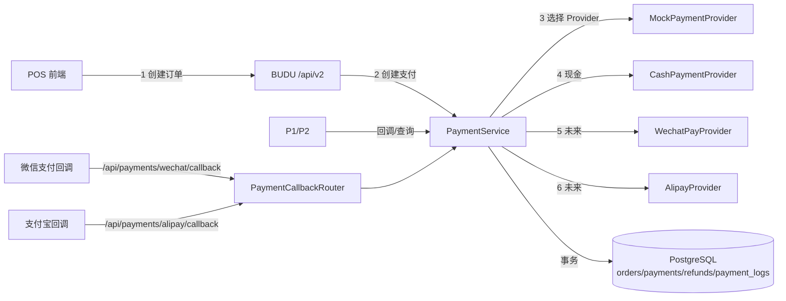

# 真实支付接入准备（第二阶段）实施计划

> 状态：已完成本地实施与验证（2026-08-11）。验收：19 项单元测试、8 项 iPad WebKit 端到端测试、`npm run build` 全部通过；待部署后在生产环境执行 `prisma migrate deploy`。

## 一、目标

在保持 POS V1 全部功能不变的前提下，把订单与支付底层补成可接真实微信/支付宝的形态：独立 payments 表补全字段、refunds 预留、支付审计日志、`PAYMENT_MODE` 模式开关、现金 Provider、回调路由规范化、支付创建事务化、前端“确认中/关闭支付”交互。

## 二、架构

## 三、数据库变更（迁移 `20260812000000_payment_prep`）

### payments 表新增
- `payment_method TEXT NOT NULL DEFAULT ''`：具体支付产品（如 qrcode / micropay / cash），channel 之上再细分。
- `request_payload JSONB`：创建支付时脱敏后的请求摘要（不含付款码、密钥）。
- `response_payload JSONB`：Provider 返回摘要（不含密钥/证书）。
- `raw_callback JSONB`：最近一次回调原文（脱敏，付款码/密钥不落库）。

### 新增 refunds 表
字段：id、refund_no（唯一）、order_id、payment_id、refund_amount（BigInt 分）、reason、status、provider_refund_no（唯一可空）、requested_by、approved_by、created_at、completed_at；order/payment 外键 RESTRICT，金额 CHECK > 0。

### 新增 payment_logs 表
字段：id、payment_id、order_id、store_key、cashier_id、event、channel、amount、status、provider_trade_no、failure_code、failure_message、callback_at、created_at；索引（order_id、payment_id、created_at）。

## 四、状态机（沿用并收紧）

订单：`draft → pending_payment → paid → completed`；`pending_payment → cancelled`；`paid/completed → partially_refunded → refunded`。
订单支付状态：`unpaid → pending → paid`；`failed/unpaid → pending`；`paid → partially_refunded → refunded`。
支付单状态：`created → pending → success`；`created/pending → failed/closed/timeout`；`success → partially_refunded/refunded`。
所有转换由 PaymentService / pos.js 执行，前端只读。

## 五、代码变更

1. `server/payments/providers/cash.js`：CashProvider，创建即成功（收银员确认现金），复用回调管道。
2. `server/payments/payment-service.js`：
   - `resolveProvider(channel, order)`：`PAYMENT_MODE=mock` → mock；`live` 时 cash → cash、wechat → wechat_pay（未配置则 501）、alipay → alipay（未配置则 501）。
   - createPayment 的支付创建 + 订单置 pending 放入 `$transaction`。
   - 记录 requestPayload / responsePayload / rawCallback（脱敏）。
   - 每次关键事件写 PaymentLog（门店/员工/订单/金额/渠道/结果/平台交易号/失败原因/回调时间）。
   - Provider 抛错时事务内标记 failed 并写日志，不再伪造回调。
   - `refundPayment()` 保持 501 占位，接口签名固定。
3. `server/payment-callbacks.js`：新增 `/wechat/callback`、`/alipay/callback`、`/mock/callback` 显式路由；`/callback/:provider` 保留并归一化 provider 名（wechat → wechat_pay）。
4. `server/pos.js`：支付创建改用 `resolveProvider`；`PAYMENT_MODE=live` 时忽略前端 mockScenario；现金走 cash Provider。
5. `src/components/PosPage.jsx`：
   - 支付中自动轮询（3 秒一次，最多 10 次），提示“正在确认支付，请勿重复付款”。
   - created/pending 支付显示「关闭当前支付」，关闭后可重新选择渠道。
   - “模拟支付”文案仅在 `paymentMode === 'mock'` 显示。
6. `.env.example`：新增 `PAYMENT_MODE=mock` 与微信/支付宝商户变量占位说明；清理美团残留注释。

## 六、API 清单（本次交付）

| 方法 | 路径 | 说明 |
| --- | --- | --- |
| POST | /api/v2/pos/orders | 创建订单（不变） |
| GET | /api/v2/pos/orders/:id | 查询订单（不变，含 payments/refunds） |
| POST | /api/v2/pos/orders/:id/payments | 创建支付（按 PAYMENT_MODE 选择 Provider） |
| GET | /api/v2/pos/payments/:id | 查询支付 |
| POST | /api/v2/pos/payments/:id/query | 主动查询支付结果 |
| POST | /api/v2/pos/payments/:id/close | 关闭未成功支付 |
| POST | /api/v2/pos/orders/:id/cancel | 取消订单（不变） |
| POST | /api/payments/wechat/callback | 微信回调（预留，验签后处理） |
| POST | /api/payments/alipay/callback | 支付宝回调（预留） |
| POST | /api/payments/mock/callback | Mock 回调（ENABLE_MOCK_CALLBACK_API=1 时可用） |

## 七、Mock 测试方法

本地/测试环境 `PAYMENT_MODE=mock`：
- 成功：`mockScenario=success`
- 失败：`mockScenario=failed`
- 处理中：`mockScenario=pending`（再查询/关闭）
- 超时：`mockScenario=timeout`
- 延迟回调：`mockScenario=delayed_success&callbackDelayMs=3000`
- 重复回调：`mockScenario=duplicate_callback`（断言只完成一次）
- 幂等：相同 requestKey 重复提交返回同一支付；相同 checkoutKey 重复结算返回同一订单

## 八、正式接微信支付前需要的商户资料

1. 微信支付商户号（mchid）与 AppID（小程序/公众号/服务商）
2. APIv3 密钥（32 字节）
3. 商户 API 证书序列号与私钥（pem）
4. 回调域名 HTTPS 公网可达（buducandy.cn 已满足）
5. 扫码支付（付款码支付）产品开通
6. 结算账户与经营类目审核通过

## 九、正式接支付宝前需要的商户资料

1. 支付宝开放平台 AppID（当面付产品）
2. 应用私钥（pem）与支付宝公钥
3. 当面付（条码支付/扫码支付）签约状态
4. 回调通知 URL 公网可达
5. 商户 PID（合作伙伴身份）与结算账户

## 十、iPad Safari 摄像头扫码测试方法

1. 使用真实 iPad（建议 iOS 16+），Safari 打开 `https://buducandy.cn/#pos`。
2. 用真实顾客付款码（任意二维码文本 ≥6 位）对准后置摄像头。
3. 首次使用会请求相机权限：允许后进入扫码框；拒绝时显示中文指引。
4. 已识别后立即暂停识别并提交支付；页面切后台会自动释放摄像头。
5. 自动播放限制：Safari 要求 HTTPS + 用户手势后启动，POS 已满足。

## 十一、已知风险与建议

1. 真实支付前必须做小金额灰度（1 分钱测试订单）并核对回调。
2. 微信/支付宝签名与字段映射以官方最新文档为准，Provider 实现需联调后定稿。
3. 建议生产使用 `PAYMENT_MODE=live` 且配置完整商户变量后才放开微信/支付宝按钮。
4. 支付日志定期归档，避免 payment_logs 无限增长。
